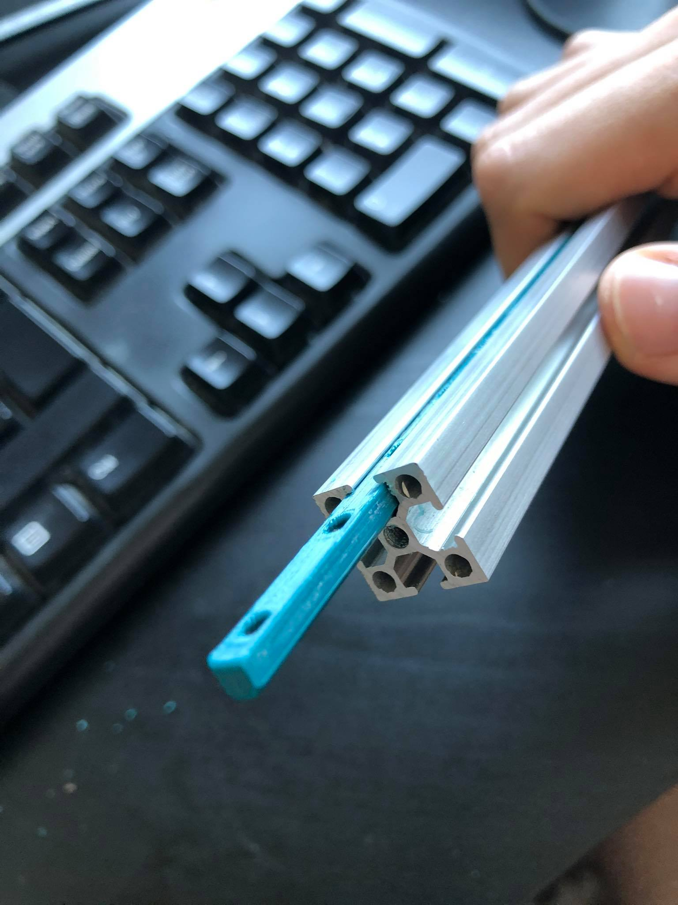
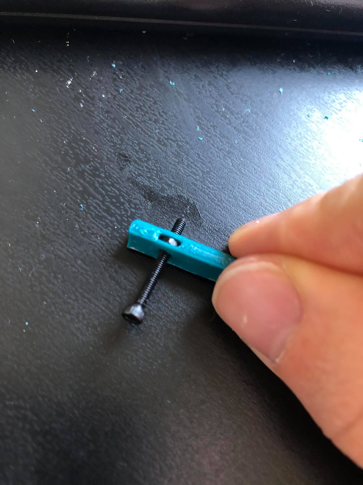
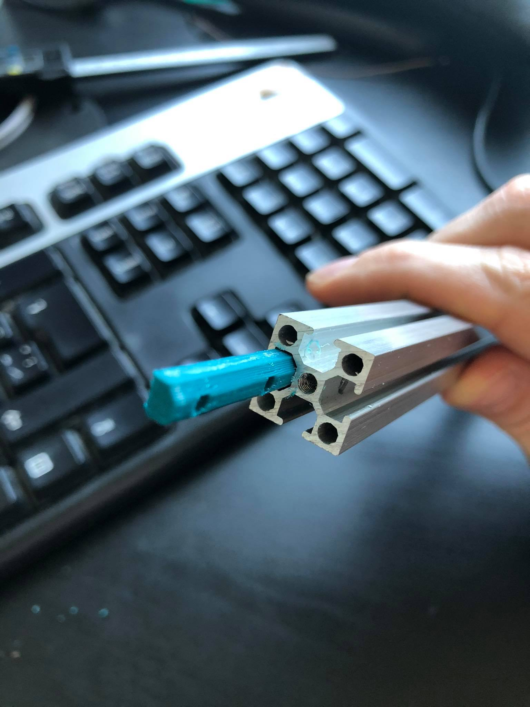
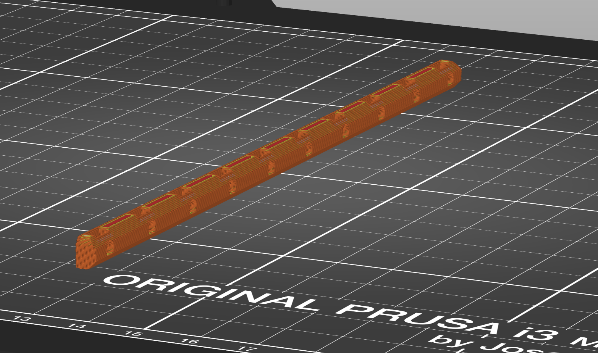

# Voron V0 captive nut holders

Assembly of the M2 nut holders can be cumbersome. Especially if you only have M2x8 screws and bluerolls extrusions.

This version of nut holders can save you a lot of time and nerves, since nuts won't go anywhere after you captivate them inside the printed part.
I got away with using M2x8 screws with these (holes are through the print).

## Print settings

I printed them on Prusa Mk3s with following settings

 * **Layer height:** 0.2mm
 * **Infill:** 30%
 * **Supports:** NOT NEEDED

Print in following orientation:

## Elephant foot

Its much less of a deal since its printed on its side, but you may still need to chamfer one side of the print with sandpaper or xacto knife.